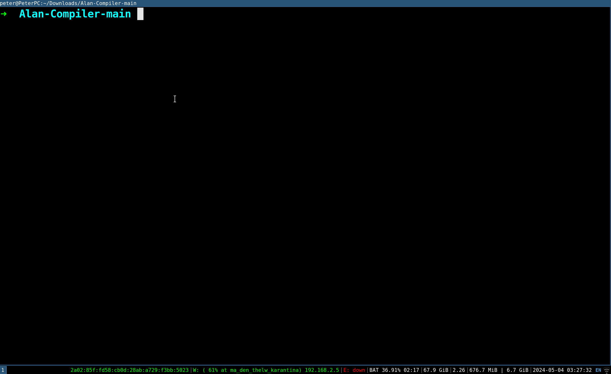

# AlanCompiler

## Dependencies
* [C++14](https://www.cplusplus.com/)
* [Bison](https://www.gnu.org/software/bison/)
* [Flex](https://en.wikipedia.org/wiki/Flex_(lexical_analyser_generator))
* [LLVM12](https://llvm.org/)

## Installation 
* ```git clone https://github.com/ntua-el15074/Alan-Compiler.git```
* ```make -C cmd```

## Usage 
The Alan executable is located in the ```bin``` folder and has been exported to 
the bash session's path for as long as the session is active.
The executable requires ```lib.a``` also located in the ```bin```, 
which was provided by professor [Kostis Sagonas](https://github.com/kostis).

* ```cd bin```
* ```alan [OPTIONS] source_file```

The compiler can be used with any of these flags
```c++
    -h, --help        Display this information
    -v, --version     Display the version of the compiler
    -o                Optimize the code
    -f                Output Intermediate Representation to Standard Output
    -s                Output Assembly to Standard Output
```

The compiler will provide an executable of the program named ```a.out```.

## Demo 
<div align="center">
    
</div>

